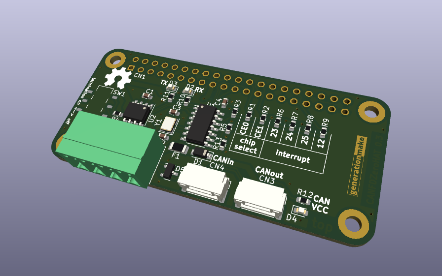

# CANFDZeroHAT
Raspberry Pi HAT with Microchip MCP2517FD or MCP2518FD CAN FD controller

## connectors

### CAN connector CN2

Terminal block with 3.81 mm grid.

| **Pin** | **Signal**    | **Description**                  |
|:-------:|:-------------:|:--------------------------------:|
| 1       | GND           |                                  |
| 2       | CAN_L         |                                  |
| 3       | CAN_H         |                                  |
| 4       | VCC           | up to 5.5 V                      |

### UAVCAN dronecode connector CN3 and CN4

compatible to UAVCAN dronecode. JST GH 1.25mm 4-pin.

| **Pin** | **Signal**    | **Description**                  |
|:-------:|:-------------:|:--------------------------------:|
| 1       | CANVCC        | up to 5.5 V                      |
| 2       | CAN_H         |                                  |
| 3       | CAN_L         |                                  |
| 4       | GND           |                                  |

CANVCC can be connected to the Raspberry Pi via diode D1 as desribed in the dronecode spec. The direction of the diode defines wether current is sourced from the connector or supplied into the UAVCAN system. If no connection is desired just leave D1 unpopulated.

## PCB

### Top

### Bottom

## Resources

### Datasheets

 * http://ww1.microchip.com/downloads/en/DeviceDoc/MCP2517FD-External-CAN-FD-Controller-with-SPI-Interface-20005688B.pdf
